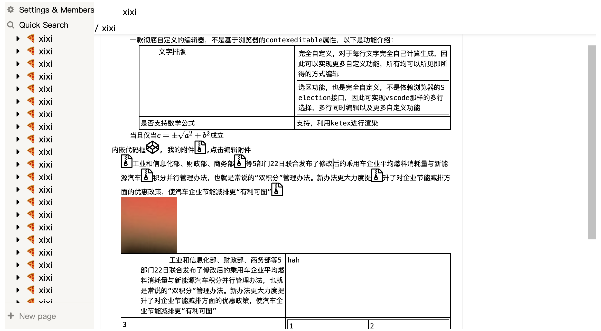

# 一款彻底自定义的编辑器
设计理念源于日常使用OneNote，但OneNote的数据不在本地，故有了此项目制作的想法。  

基础效果展示：


运行方式：
npm 或 yarn，以npm为例：  
```
npm install
npm run build
npm run serve
```
然后访问 localhost:3000

>! 本项目已经不再开发，虽然方式可行，但如果最终制作出来也只是扩展功能比OneNote稍好一点的复制品，且所有功能由于都是原生实现，耗时过多，故不再开发。

>后续将启动新项目基于markdown实现